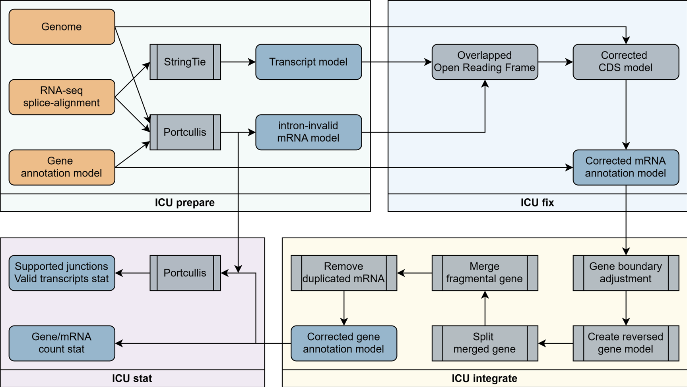

# Intron Correction Utility (ICU)

A Python-based utility for correcting invalid introns in genome annotations using RNA-seq splice-alignment data.



## Getting Started

### Dependency
- Python 3.6+ (tested at v3.9.23)
- [Portcullis](https://github.com/EI-CoreBioinformatics/portcullis) (tested at v1.2.4) - Required for `prepare` and `stat` modules
- [gffread](https://github.com/gpertea/gffread) (tested at v0.12.7) - Required for `prepare` and `stat` module
- [StringTie](https://github.com/gpertea/stringtie) (tested at v3.0.3) - Required for `prepare` module

### Installation

ICU do not need to be installed. Just clone the ICU repository or download all scripts to the same folder.

The dependency can be easily resolved via conda / mamba: 

```bash
conda create -n ICU --channel conda-forge --channel bioconda portcullis stringtie gffread
```

## Usage

### Pipeline Mode

For typical workflows, use the `pipe` subcommand to run all four modules in sequence:

```
python ICU.py pipe <genome_fasta> <input_gff3> <bam_files1> <bam_files2> ... [--options]
```

```
positional arguments:
  genome_fasta          Reference genome, FASTA format
  input_gff3            Genome annotation, GFF3 format
  bam_files             splice-alignment(s) against reference genome, BAM format

optional arguments:
  -h, --help            show this help message and exit
  --min-junc MIN_JUNC   Ignore splice-alignment that supported by lower than (default: 10) read pairs
  --min-orf-length MIN_ORF_LENGTH
                        Avoid using ORF on StringTie assembled transcript shorter than (default: 300) bp to replace invalid transcript
  --rename RENAME       Rename all gene and its child record ID begin with prefix+number; if not set, join original ID with operation (default: not set)
  --prefix PREFIX       Generate output file named started with (default: ICU)
  -p PROCESS, --process PROCESS
                        Process limit for stringtie and portcullis.  If set as 0, will use as much as possible (default: 1)
  --debug               Print DEBUG level logs
  --portcullis PORTCULLIS
                        portcullis executable path, default: $PATH
  --stringtie STRINGTIE
                        stringtie executable path, default: $PATH
  --junctools JUNCTOOLS
                        junctools executable path, default: $PATH
  --gffread GFFREAD     gffread executable path, default: $PATH
```

### Modules

ICU is organized into four modules, each handling a specific task in the annotation correction workflow:

#### prepare
```
python ICU.py prepare <genome_fasta> <input_gff3> <bam_files1> <bam_files2> ... [--options]
```

```
positional arguments:
  genome_fasta          Reference genome, FASTA format
  input_gff3            Genome annotation, GFF3 format
  bam_files             splice-alignment(s) against reference genome, BAM format

optional arguments:
  -h, --help            show this help message and exit
  --min-junc MIN_JUNC   Ignore splice-alignment that supported by lower than (default: 10) read pairs
  --prefix PREFIX       Generate output file named started with (default: ICU)
  -p PROCESS, --process PROCESS
                        Process limit to use for stringtie and portcullis. If set as 0, will use as much as possible (default: 1)
  --debug               Print DEBUG level logs
  --portcullis PORTCULLIS
                        portcullis executable path, default: $PATH
  --stringtie STRINGTIE
                        stringtie executable path, default: $PATH
  --junctools JUNCTOOLS
                        junctools executable path, default: $PATH
  --gffread GFFREAD     gffread executable path, default: $PATH

```

**Purpose:** Identify incorrect introns and create a trusted transcript structure database

**Process:**
1. Calls Portcullis to perform junction analysis based on splice-alignment data, marking introns that lack sufficient splice-alignment support as invalid
2. Calls StringTie to assemble transcript models based on splice-alignment data, creating a trusted reference database of valid transcript structures

**Inputs:**
- Genome reference (FASTA format)
- Gene annotation (GFF3 format)
- RNA-seq splice-alignment data (one or more BAM files)

**Outputs:**
- `{prefix}.merged.stringtie.gtf` - Merged trusted transcript models
- `{prefix}.markup.gtf` - Invalid-intron-marked annotation
- `{prefix}_portcullis_out/` - Portcullis working directory

#### fix
```
python ICU.py fix <portcullis_gtf> <trusted_gtf> <genome_fasta> <input_gff3> [--options]
```

```
positional arguments:
  portcullis_gtf        Portcullis-[junctools gtf markup] marked transcript annotation, GTF format
  trusted_gtf           trusted transcript annotation, GTF format
  genome_fasta          Reference genome, FASTA format
  input_gff3            Genome annotation, GFF3 format

optional arguments:
  -h, --help            show this help message and exit
  -o OUT, --out OUT     Generate output file named (default: ICU.intermediate.gff3)
  --min-orf-length MIN_ORF_LENGTH
                        Avoid using ORF on trusted transcript shorter than (default: 300) bp to replace invalid transcript
  --debug               Print DEBUG level logs
```

**Purpose:** Correct invalid mRNA annotations using trusted transcript structures

**Process:**
1. For each invalid-marked mRNA, locates a supported transcript model at the same genomic locus 
2. Rebuilds the coding sequence structure annotation records based on the transcript model

**Inputs:**
- Invalid-intron-marked annotation (GTF, typically from `prepare` module)
- Trusted transcript models (GTF, typically from `prepare` module)
- Genome reference (FASTA format)
- Gene annotation (GFF3 format)

**Outputs:**
- `{prefix}.intermediate.gff3` - Intermediate annotation with corrected mRNA records

#### integrate
```
python ICU.py integrate <fixed_gff3>[--options]
```

```
positional arguments:
  fixed_gff3         Intermediate GFF3 file which new mRNA not integrated into gene record

optional arguments:
  -h, --help         show this help message and exit
  -o OUT, --out OUT  Generate output file named (default: ICU.integrated.gff3)
  --rename RENAME    Rename all gene and its child record ID begin with prefix+number; if not set, join original ID with operation (default: not set)
  --debug            Print DEBUG level log
```

**Purpose:** Adjust gene records according to corrected mRNA annotations

**Process:**
1. **Adjust gene boundaries** - Aligns gene coordinates with corrected mRNA boundaries
2. **Handle strand inconsistencies** - Creates new genes if corrections move mRNA to different strand
3. **Split genes with gaps** - Divides genes when correction creates gaps between mRNA features
4. **Merge overlapping genes** - Combines genes that now overlap after corrections
5. **Remove redundant mRNA** - Eliminates duplicate mRNA within genes
6. Optionally renames all gene and child records with consistent numbering

**Inputs:**
- Intermediate annotation (GFF3 format, typically from `fix` module)

**Outputs:**
- `{prefix}.integrated.gff3` - Final corrected annotation in GFF3 format

#### stat
```
python ICU.py stat <previous_gff3> <corrected_gff3> <portcullis_out> [--options]
```

```
positional arguments:
  previous_gff3         Genome annotation (before process), GFF3 format
  corrected_gff3        Genome annotation (after process), GFF3 format
  portcullis_out        portcullis output folder

optional arguments:
  -h, --help            show this help message and exit
  --prefix PREFIX       Generate output file named started with (default: ICU)
  --debug               Print DEBUG level logs
  --junctools JUNCTOOLS
                        junctools executable path, default: $PATH
  --gffread GFFREAD     gffread executable path, default: $PATH
```

**Purpose:** Generate statistical reports on annotation corrections

**Process:**
1. Counts genes and mRNA before and after correction
2. Calls Portcullis utilities `junctools` to calculate supported intron counts and supported mRNA counts

**Inputs:**
- Original annotation (GFF3 format)
- Corrected annotation (GFF3 format, typically from `integrate` module)
- Portcullis working directory (typically from `prepare` module)

**Outputs:**
- `{prefix}.stat` - Statistical reports comparing before/after corrections

## Citation

TBD

